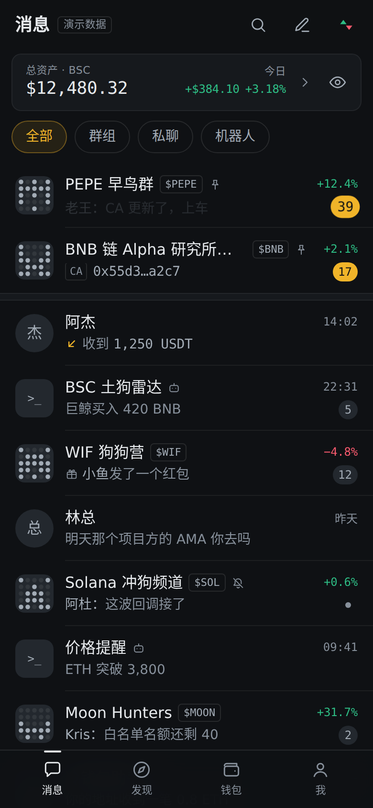
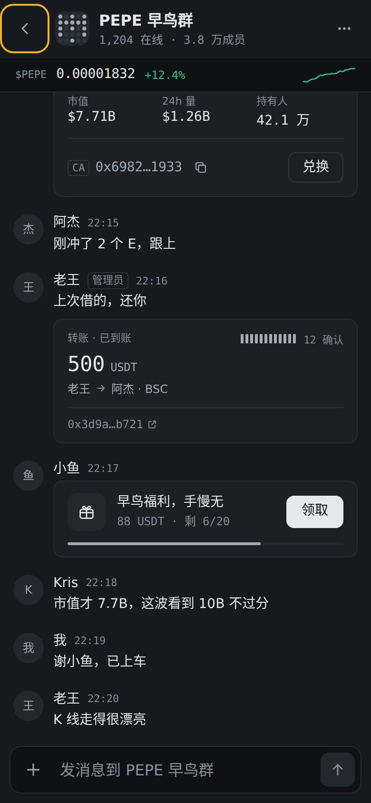
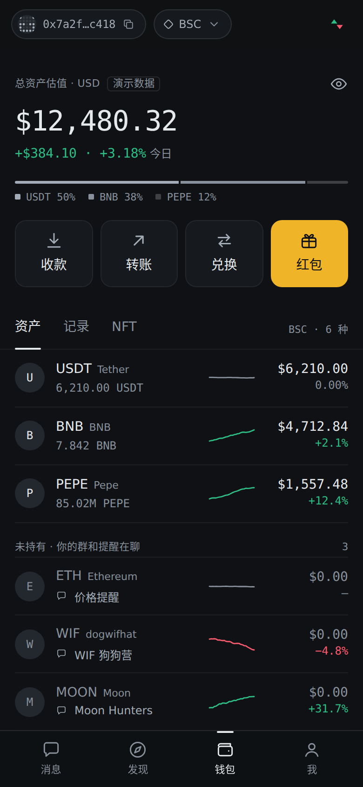
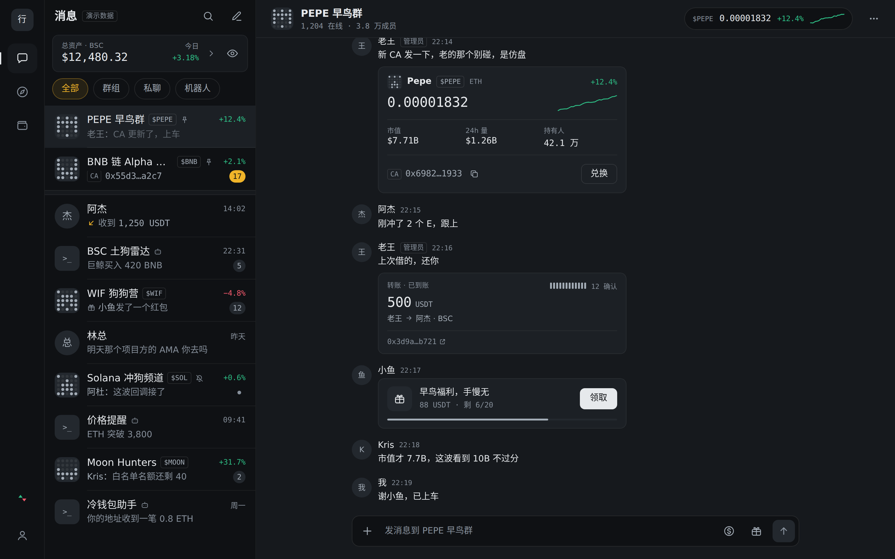
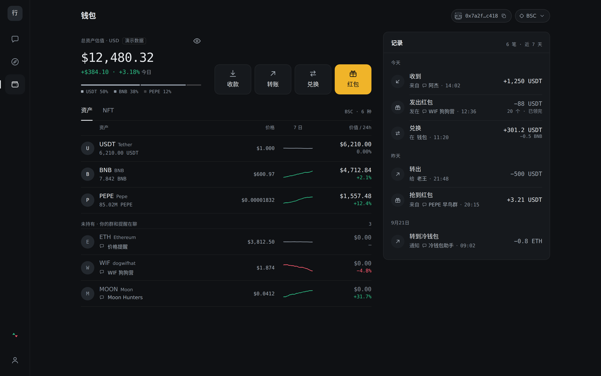

# 行情屏 · Web3 IM 设计稿

一个带钱包体系的币圈社群即时通讯工具的界面设计，包含**会话主页**和**钱包页**两屏，手机和桌面各有独立布局。

**在线预览：** https://defitrail.github.io/im-preview/market-screen/

**Walletalk 标志与视觉规范：** https://defitrail.github.io/im-preview/brand/ （含源文件包下载）

**命名候选：** https://defitrail.github.io/im-preview/names/ （50 个英文名 + 含义 + logo 草图 + 撞名初查）

| 手机 · 会话 | 手机 · 聊天 | 手机 · 钱包 |
|---|---|---|
|  |  |  |

## 设计方向

交易所墙上的 LED 行情屏：石墨黑的四层表面、等宽数字，只有一种琥珀色强调。

- **群行挂行情**：群名后面带着它在聊的币和 24 小时涨跌，一眼看出哪个群在动
- **两档未读**：热群未读是琥珀色，普通群是灰色，免打扰只显示一个点
- **转账、红包、合约地址**在会话预览和聊天里各有专门的样式
- **钱包记录回溯来源**：每一笔都注明来自哪个聊天，点一下就能跳回去
- **红涨绿跌开关**：数字、走势线和闪烁颜色一起切换

## 可以试试

- 手机宽度下点一个会话，聊天层会从右侧滑进来
- 右上角（桌面在左栏下方）的 ▲▼ 切换涨跌配色
- 钱包页点眼睛图标，两屏所有余额都会遮挡
- 钱包记录里带聊天气泡的条目，点击跳回对应聊天
- 在链接后加 `#s-empty`、`#s-loading`、`#s-offline`、`#s-newwallet` 查看空状态、加载、离线和新钱包

## 说明

单个 HTML 文件，没有构建步骤，字体来自 Google Fonts。所有数据都是演示数据，没有接入任何链上服务。
